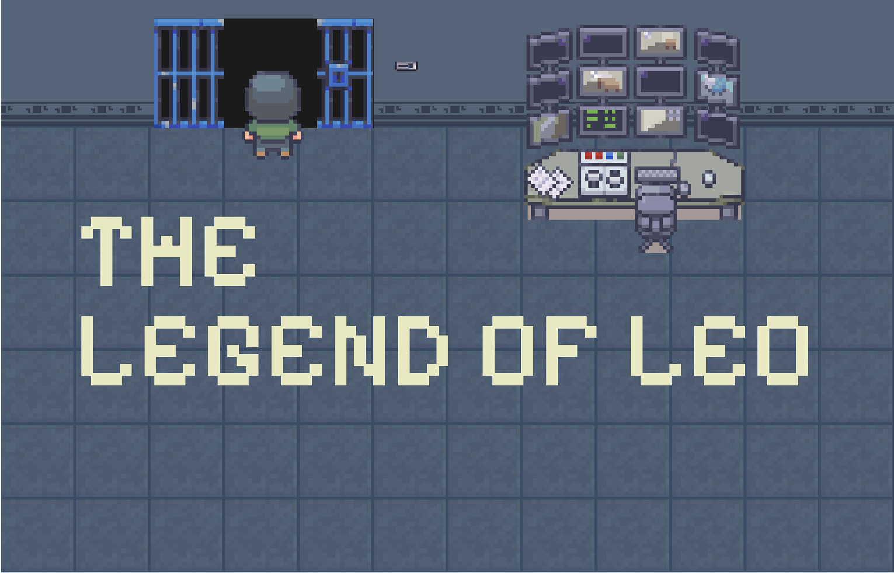

# Legend of Leo

A blockchain learning adventure that teaches Aleo concepts through interactive gameplay.



## Overview

Legend of Leo is an educational game that transforms complex blockchain concepts into an engaging narrative experience. Players explore a world where they learn about privacy, cryptography, zero-knowledge proofs, and the Aleo ecosystem through interactive gameplay rather than technical documentation.

## Game Concept

Guide Leo through five progressive levels, each teaching different aspects of blockchain technology and privacy concepts. Interact with NPCs, explore buildings, solve puzzles, and gradually build your understanding of blockchain and Aleo's technologies.

## Features

- **Interactive Learning**: Learn by doing rather than reading
- **Progressive Difficulty**: Concepts build upon each other naturally through gameplay
- **Multiple Environments**: Explore various locations representing different blockchain concepts
- **NPC Interactions**: Engage with characters that explain concepts in approachable ways
- **Mini-map Navigation**: Easily explore larger environments
- **Automatic Progress Saving**: Continue your journey at any time

## Game Structure

- **Level 1**: Introduction to blockchain fundamentals and privacy basics
- **Level 2**: Exploring cryptographic concepts
- **Level 3**: Learning about zero-knowledge proofs
- **Level 4**: Understanding blockchain privacy
- **Level 5**: Aleo ecosystem integration - explore buildings representing different aspects of Aleo's technology

## Installation

### Prerequisites

- Node.js (v14.0.0 or later)
- npm or yarn

### Setup

1. Clone the repository

   ```bash
   git clone https://github.com/your-username/legend-of-leo.git
   cd legend-of-leo
   ```

2. Install dependencies

   ```bash
   npm install
   # or
   yarn install
   ```

3. Start the development server

   ```bash
   npm run dev
   # or
   yarn dev
   ```

4. Open your browser and navigate to `http://localhost:3000`

## Building for Production

```bash
npm run build
# or
yarn build
```

## Technologies

- **Next.js**: React framework for the web application
- **Phaser**: Game development engine
- **TypeScript**: Type-safe coding
- **Tailwind CSS**: Styling and UI components
- **React Context API**: State management

## Project Structure

```
legend-of-leo/
├── components/           # React components
│   ├── game/             # Game-specific components
│   │   ├── scenes/       # Phaser scenes for each level
│   │   └── ...
│   └── layout/           # Layout components
├── lib/                  # Utility functions, contexts, and game logic
│   ├── classes/          # Game classes (Player, etc.)
│   ├── contexts/         # React contexts
│   ├── game/             # Game configuration
│   └── utils/            # Utility functions
├── public/               # Static assets
│   └── assets/           # Game assets (sprites, maps, etc.)
├── pages/                # Next.js pages
└── styles/               # Global styles
```

## Game Controls

- **Arrow Keys**: Move Leo around the world
- **Spacebar**: Interact with NPCs and objects
- **M Key**: Toggle mini-map visibility
- **D Key**: Toggle debug mode (development only)

## Development Notes

- The game uses localStorage to save player progress
- Phaser scenes are loaded dynamically based on game progression
- Custom map editor was used to create the game environments

## Contributing

Contributions are welcome! Please feel free to submit a Pull Request.

1. Fork the repository
2. Create your feature branch (`git checkout -b feature/amazing-feature`)
3. Commit your changes (`git commit -m 'Add some amazing feature'`)
4. Push to the branch (`git push origin feature/amazing-feature`)
5. Open a Pull Request

## License

This project is licensed under the MIT License - see the LICENSE file for details.

## Acknowledgments

- Aleo team for inspiring the educational content
- Phaser community for game development resources
- All contributors who have helped shape this project

---

**Legend of Leo** - An Aleo Blockchain Learning Adventure
